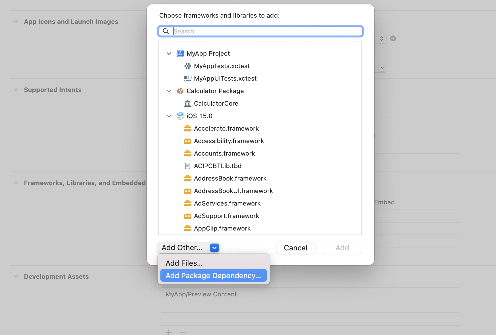
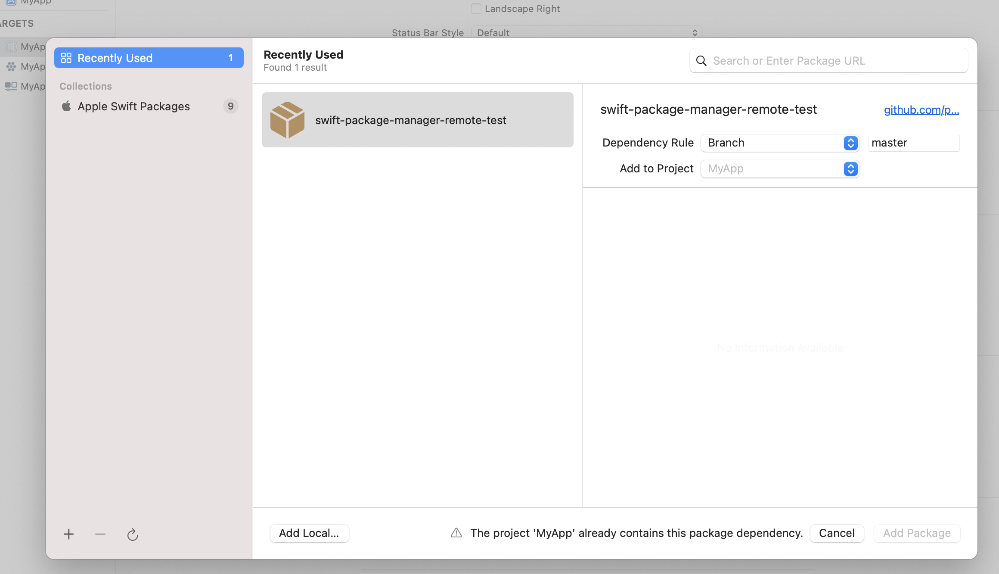

# Article

[https://itnext.io/modularize-xcode-projects-using-local-swift-packages-8fd844c19081](https://itnext.io/modularize-xcode-projects-using-local-swift-packages-8fd844c19081)

# Init

```bash
$ swift package init --type executable
```

# #1 Create Directory Structure

- Sources
    - package.swift
    - README.md
    - Calculator
        - main.swift
    - CalculatorCore
        - Operator.swift
        - calculate.swift
        
        ⇒ must be defined with `public`
        

# #2 Source Code

... this depends on what you build

# #3 package.swift

```swift
let package = Package(
    name: "Calculator",
    products: [
        .library(name: "CalculatorCore", 
                 targets: ["CalculatorCore"])
    ],
    targets: [
        .target(name: "CalculatorCore"),
        .target(name: "Calculator",
                dependencies: ["CalculatorCore"]),
        .testTarget(name: "CalculatorTests",
                    dependencies: ["Calculator"]),
    ]
)
```

### Package Descriptions in detail

```swift

import PackageDescription
let package = Package(
    name: "SPMDemo",
    products: [
        // Products define the executables and libraries produced by a package, and make them visible to other packages.
        .library(
            name: "SPMDemo",
            targets: ["SPMDemo"]),
    ],
    dependencies: [
        // Dependencies declare other packages that this package depends on.
        // .package(url: /* package url */, from: "1.0.0"),
    ],
    targets: [
        // Targets are the basic building blocks of a package. A target can define a module or a test suite.
        // Targets can depend on other targets in this package, and on products in packages which this package depends on.
        .target(
            name: "SPMDemo",
            dependencies: []),
        .testTarget(
            name: "SPMDemoTests",
            dependencies: ["SPMDemo"]),
    ]
)


```


# #4 Git push
```bash
	git add . 
	git commit -m ""
	git push ..
```

# #5 Fetch created package from xCode




